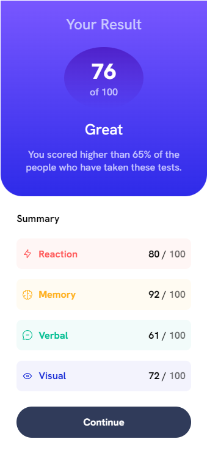

# Frontend Mentor - Single price grid component solution

This is a solution to the [Single price grid component challenge on Frontend Mentor](https://www.frontendmentor.io/challenges/single-price-grid-component-5ce41129d0ff452fec5abbbc). Frontend Mentor challenges help you improve your coding skills by building realistic projects. 

## Table of contents

- [Overview](#overview)
  - [The challenge](#the-challenge)
  - [Screenshot](#screenshot)
  - [Links](#links)
- [My process](#my-process)
  - [Built with](#built-with)
  - [What I learned](#what-i-learned)
  - [Continued development](#continued-development)
  - [Useful resources](#useful-resources)
- [Author](#author)
- [Acknowledgments](#acknowledgments)

**Note: Delete this note and update the table of contents based on what sections you keep.**

## Overview

It is a Frontend mentor challenge, which consists of a brochure that is divided into different rows and columns depending on the device.

### The challenge

Users should be able to:

- View the optimal layout for the component depending on their device's screen size
- See a hover state on desktop for the Sign Up call-to-action

### Screenshot

 

Add a screenshot of your solution. The easiest way to do this is to use Firefox to view your project, right-click the page and select "Take a Screenshot". You can choose either a full-height screenshot or a cropped one based on how long the page is. If it's very long, it might be best to crop it.

Alternatively, you can use a tool like [FireShot](https://getfireshot.com/) to take the screenshot. FireShot has a free option, so you don't need to purchase it. 

Then crop/optimize/edit your image however you like, add it to your project, and update the file path in the image above.

**Note: Delete this note and the paragraphs above when you add your screenshot. If you prefer not to add a screenshot, feel free to remove this entire section.**

### Links

- Solution URL: [Add solution URL here](https://github.com/cyeguez/results-summary-component)
- Live Site URL: [Add live site URL here](https://cyeguez.github.io/results-summary-component/)

## My process

My process begins with create the repository in the gitHub and bring it to local, establish the folder systems and in this case add sass, then analyze the dimensions of the elements, I use figma to determine the measurements, then in the HTML I divide the content and I use the relevant tags, then I start with the styles and defining media queris.

### Built with

- Semantic HTML5 markup
- CSS custom properties
- Flexbox
- CSS Grid
- Mobile-first workflow

### What I learned

By persevering details in the design, to build and destroy without fear of error, to pause and then continue.

If you want more help with writing markdown, we'd recommend checking out [The Markdown Guide](https://www.markdownguide.org/) to learn more.

**Note: Delete this note and the content within this section and replace with your own learnings.**

### Continued development

I want to continue learning js in depth and perfect my layout with HTML and CSS

**Note: Delete this note and the content within this section and replace with your own plans for continued development.**

## Author

- Frontend Mentor - [@cyeguez](https://www.frontendmentor.io/profile/cyeguez)
- Twitter - [@yourusername](https://www.twitter.com/yourusername)

